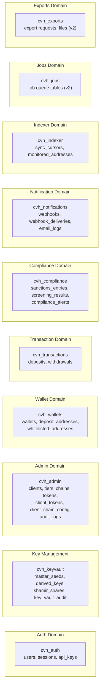
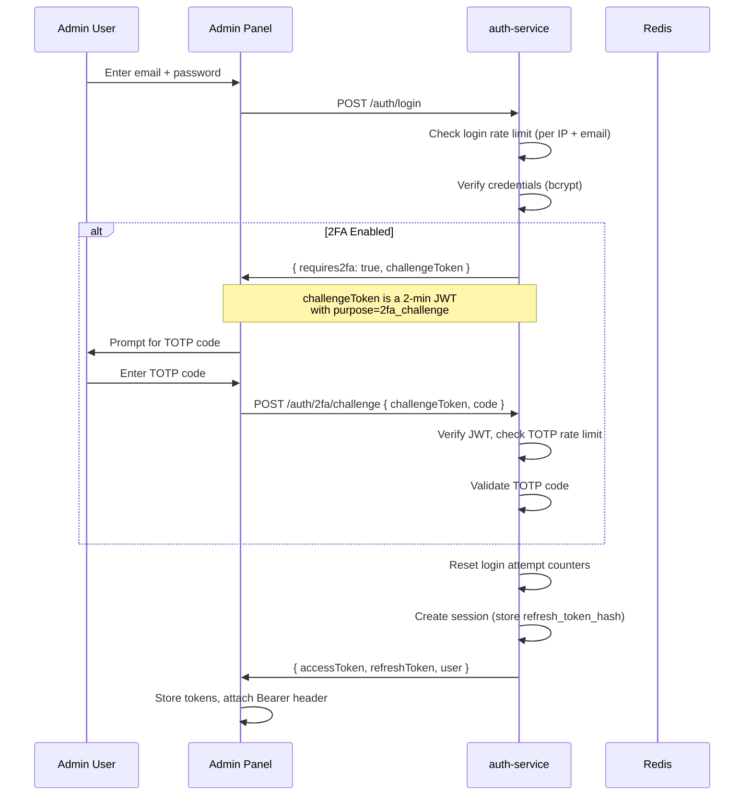
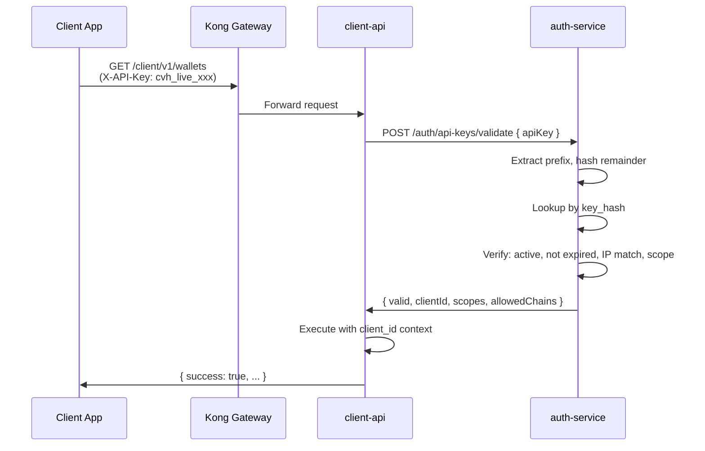
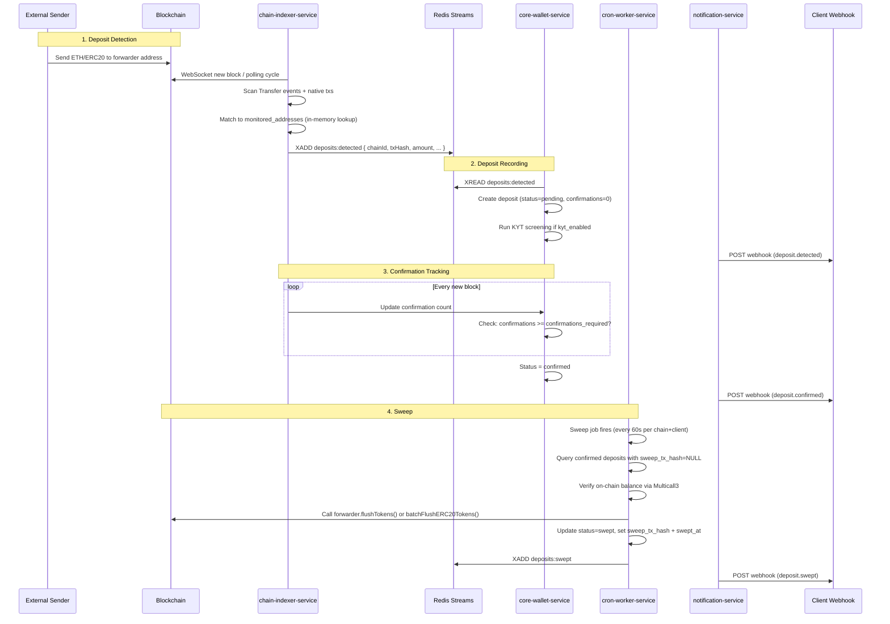

# CryptoVaultHub v2 -- Architecture Overview

## 1. What is CryptoVaultHub?

CryptoVaultHub (CVH) is a **B2B SaaS multi-tenant blockchain wallet management platform**. It provides enterprise clients (exchanges, payment gateways, neobanks, custodians) with a complete infrastructure for:

- Deterministic deposit address generation (CREATE2 forwarders)
- Automated deposit detection and confirmation tracking
- Secure key management with Shamir secret sharing
- Multi-chain ERC-20 and native token sweeps
- Multisig withdrawal processing with optional co-signing
- KYT/AML compliance screening (OFAC, EU, UN sanctions)
- Webhook-based real-time event notifications

Each client is fully isolated via `client_id` scoping across all databases. Clients are organized into **tiers** (Starter, Business, Enterprise) that govern rate limits, chain access, withdrawal limits, and compliance levels.

---

## 2. Service Topology

CVH consists of **8 backend microservices**, **2 frontend applications**, and supporting infrastructure.

```mermaid
graph TB
    Internet((Internet<br/>ports 80/443))

    subgraph Docker["Docker Host"]
        Traefik["Traefik v3.0<br/>Auto SSL · Let's Encrypt"]

        subgraph "Public Zone"
            AdminUI["admin.vaulthub.live<br/>Admin Panel (Next.js)"]
            ClientUI["portal.vaulthub.live<br/>Client Portal (Next.js)"]
            Kong["api.vaulthub.live<br/>Kong API Gateway"]
        end

        subgraph "Application Services"
            AdminAPI["admin-api<br/>(:3001)"]
            ClientAPI["client-api<br/>(:3002)"]
            AuthSvc["auth-service<br/>(:3003)"]
            CoreWallet["core-wallet-service<br/>(:3004)"]
            ChainIndexer["chain-indexer-service<br/>(:3006)"]
            NotifSvc["notification-service<br/>(:3007)"]
            CronWorker["cron-worker-service<br/>(:3008)"]
            RpcGw["rpc-gateway-service<br/>(:3009)"]
        end

        subgraph "Vault Zone (isolated)"
            KeyVault["key-vault-service<br/>(:3005)"]
        end

        subgraph "Infrastructure"
            Redis["Redis 7<br/>(cache + BullMQ)"]
        end

        subgraph "Monitoring"
            Prometheus["Prometheus"]
            Grafana["grafana.vaulthub.live<br/>Grafana"]
            Loki["Loki"]
            Promtail["Promtail<br/>(log shipping)"]
            Alertmanager["Alertmanager<br/>(3 alert rules)"]
            Jaeger["jaeger.vaulthub.live<br/>Jaeger"]
            PostHog["PostHog"]
        end
    end

    MySQL["MySQL 8.0+<br/>(10 databases)"]

    Internet --> Traefik
    Traefik --> AdminUI
    Traefik --> ClientUI
    Traefik --> Kong
    Traefik --> Grafana
    Traefik --> Jaeger

    Kong --> AdminAPI
    Kong --> ClientAPI
    Kong --> AuthSvc

    AdminAPI --> MySQL
    AdminAPI --> Redis
    ClientAPI --> MySQL
    ClientAPI --> Redis
    AuthSvc --> MySQL
    AuthSvc --> Redis
    CoreWallet --> MySQL
    CoreWallet --> Redis
    CoreWallet --> KeyVault
    ChainIndexer --> MySQL
    ChainIndexer --> Redis
    ChainIndexer --> RpcGw
    NotifSvc --> MySQL
    NotifSvc --> Redis
    CronWorker --> MySQL
    CronWorker --> Redis
    KeyVault --> MySQL
    RpcGw --> MySQL
    Prometheus --> Traefik
```



### MySQL Deployment Options

MySQL is **not** part of the Docker Compose stack by default. The `scripts/setup.sh` wizard offers two modes:

| Mode | Use Case | Details |
|------|----------|---------|
| **Docker MySQL** | Development / staging / single-server | A MySQL 8.0 container is added to `docker-compose.yml`. Data is persisted in `/docker/data/mysql`. |
| **External MySQL Cluster** | Production | You provide the host, port, user, and password of your own MySQL 8.0+ cluster. No MySQL container is started. |

Both modes create the same set of databases (`cvh_admin`, `cvh_auth`, `cvh_keyvault`, `cvh_wallets`, `cvh_transactions`, `cvh_compliance`, `cvh_notifications`, `cvh_indexer`, `cvh_jobs`, `cvh_exports`). The choice is configured during `scripts/setup.sh` and stored in `.env`.

### Reverse Proxy -- Traefik v3.0

Traefik v3.0 serves as the single entry point for all external traffic. It is the only container that exposes ports 80 and 443 to the internet. Key characteristics:

- **Automatic SSL**: Let's Encrypt certificates are provisioned and renewed automatically via ACME HTTP-01 challenge. No manual certificate setup or renewal scripts are needed.
- **Docker label routing**: Each service declares its routing rules (Host, PathPrefix, middleware) as Docker labels in `docker-compose.yml`. No separate config files like `nginx.conf` are required.
- **Subdomain-based routing**: Traffic is routed based on the Host header to the appropriate service:
  - `admin.vaulthub.live` -> Admin Panel (Next.js)
  - `portal.vaulthub.live` -> Client Portal (Next.js)
  - `api.vaulthub.live` -> Kong API Gateway
  - `grafana.vaulthub.live` -> Grafana
  - `jaeger.vaulthub.live` -> Jaeger
- **HTTP-to-HTTPS redirect**: All HTTP traffic on port 80 is automatically redirected to HTTPS on port 443.

### Service Responsibilities

| Service | Port | Responsibility |
|---------|------|---------------|
| **admin-api** | 3001 | Client/chain/tier/token/compliance management, monitoring dashboard, project management, job management, RPC management, sync management, export management, KnowledgeBaseModule (article CRUD), project contracts |
| **client-api** | 3002 | Wallet queries, deposit address generation, withdrawals, webhooks, address book, co-sign, projects, flush operations, deploy traces, address groups, exports, KnowledgeBaseModule (article reader with Fuse.js search) |
| **auth-service** | 3003 | JWT login/refresh/logout, TOTP 2FA, API key issuance and validation, RBAC, impersonation |
| **core-wallet-service** | 3004 | Wallet creation, balance queries, deposit address computation, withdrawal signing, compliance screening, CoSignModule (co-sign operation orchestration) |
| **key-vault-service** | 3005 | HD key generation, Shamir secret sharing (3-of-5), transaction signing, key audit logging |
| **chain-indexer-service** | 3006 | Hybrid polling + WebSocket block scanning, ERC-20 Transfer event detection, native transfer detection, confirmation tracking, reconciliation, ReorgRollbackHandler (chain reorganization detection and deposit re-evaluation), AddressRegistrationHandler (live monitored address updates) |
| **notification-service** | 3007 | Webhook delivery with retry, HMAC signing, email notifications, event consumption from Redis Streams |
| **cron-worker-service** | 3008 | Forwarder contract deployment, token sweep/flush, gas tank monitoring, sanctions list sync (InternalServiceGuard protected) |

### Frontend Applications

| App | Port | Description |
|-----|------|-------------|
| **Admin Panel** | 3010 | Next.js dashboard for platform operators. Client management, chain config, compliance alerts, monitoring, BI/analytics (integrated -- no separate app). |
| **Client Portal** | 3011 | Next.js dashboard for client organizations. Wallet overview, deposits, withdrawals, webhook config, API key management. |

---

## 3. Database Architecture

CVH uses **10 MySQL 8.0+ databases**, each scoped to a specific domain. This separation enables independent scaling, backup granularity, and security boundaries.



| Database | Service(s) | Tables | Purpose |
|----------|-----------|--------|---------|
| `cvh_auth` | auth-service | users, sessions, api_keys | Authentication, authorization, API key lifecycle |
| `cvh_keyvault` | key-vault-service | master_seeds, derived_keys, shamir_shares, key_vault_audit | Encrypted key storage, Shamir shares, signing audit trail |
| `cvh_admin` | admin-api, core-wallet-service | clients, tiers, chains, tokens, client_tokens, client_chain_config, client_tier_overrides, audit_logs | Platform configuration, client management, chain/token registry |
| `cvh_wallets` | core-wallet-service, cron-worker-service | wallets, deposit_addresses, whitelisted_addresses | Wallet records, deposit address inventory, whitelist |
| `cvh_transactions` | core-wallet-service, cron-worker-service | deposits, withdrawals | Deposit and withdrawal lifecycle tracking |
| `cvh_compliance` | core-wallet-service, cron-worker-service | sanctions_entries, screening_results, compliance_alerts | Sanctions lists, screening results, compliance alerts |
| `cvh_notifications` | notification-service | webhooks, webhook_deliveries, email_logs | Webhook config, delivery tracking, email audit |
| `cvh_indexer` | chain-indexer-service | sync_cursors, monitored_addresses | Block sync progress, watched deposit addresses |
| `cvh_jobs` | cron-worker-service | (v2 tables) | Job queue state, dead letter, retry tracking |
| `cvh_exports` | admin-api, client-api | (v2 tables) | CSV/JSON export requests and file references |

All databases use `utf8mb4_unicode_ci` collation and InnoDB engine. Cross-database views exist in `cvh_wallets` for traceability reporting (see `database/011-traceability-views.sql`).

---

## 4. Network Topology

Docker Compose defines four isolated networks:

| Network | Type | Access | Services |
|---------|------|--------|----------|
| `public-net` | bridge | External-facing | Traefik, Kong, admin-api, client-api, admin (UI), client (UI) |
| `internal-net` | bridge, **internal: true** | Service-to-service only | All backend services, Redis, Loki, Jaeger, PostHog |
| `vault-net` | bridge, **internal: true** | Isolated key operations, mTLS enabled | key-vault-service, core-wallet-service only |
| `monitoring-net` | bridge | Observability stack | Prometheus, Grafana, Loki, Promtail, Alertmanager, Jaeger, PostHog (+ Kafka, ClickHouse, Zookeeper) |

**Traefik** is the single entry point on `public-net`, exposing only ports 80 and 443 to the internet. All other services are routed through Traefik via Docker label-based subdomain routing. No other container exposes ports externally.

The `vault-net` is deliberately isolated so that **only** `core-wallet-service` can reach `key-vault-service`. The key vault has no Redis dependency and no public network access. Communication over vault-net is protected by mTLS (`VAULT_TLS_ENABLED=true` by default) with certificates generated via `scripts/generate-vault-certs.sh`. Internal service-to-service calls are additionally authenticated via the `INTERNAL_SERVICE_KEY` shared secret. The `docker-proxy` container runs on a dedicated network for Docker socket access isolation.

---

## 5. Technology Stack

| Layer | Technology | Version | Purpose |
|-------|-----------|---------|---------|
| **Language** | TypeScript | 5.4+ | All services and frontends |
| **Runtime** | Node.js | 20+ | Backend and build |
| **Backend Framework** | NestJS | latest | All microservices |
| **Frontend Framework** | Next.js | latest | Admin Panel, Client Portal |
| **ORM** | Prisma | latest | Database access (per-service schema) |
| **Database** | MySQL | 8.0+ | Primary data store (10 databases) |
| **Cache / Queue** | Redis 7 | Alpine | Caching, BullMQ job queues, Redis Streams (with XPENDING/XCLAIM recovery) |
| **API Gateway** | Kong | 3.6 | Rate limiting, routing, CORS, request size limiting |
| **Reverse Proxy / TLS** | Traefik | v3.0 | Automatic SSL via Let's Encrypt, subdomain routing via Docker labels, single entry point (ports 80/443) |
| **Blockchain** | ethers.js | 6.x | EVM RPC interaction |
| **Smart Contracts** | Solidity | 0.8.27 | CvhWalletSimple, CvhForwarder, CvhForwarderFactory, CvhBatcher |
| **Contract Tooling** | Hardhat | latest | Contract compilation, testing, deployment |
| **Monorepo** | Turborepo | 2.3+ | Build orchestration across workspaces |
| **Containerization** | Docker Compose | 3.9 | Local and production deployment |
| **Monitoring** | Prometheus | 2.50 | Metrics collection (15s scrape interval) |
| **Dashboards** | Grafana | 10.3 | Visualization and alerting |
| **Logging** | Loki | 2.9 | Log aggregation |
| **Tracing** | Jaeger | 1.54 | Distributed tracing (OpenTelemetry, port 4318) |
| **Product Analytics** | PostHog | latest | User behavior tracking, feature flags (+ ClickHouse, Kafka, Postgres) |

---

## 6. Authentication Flows

### Admin Authentication (JWT)

Admin users authenticate via email/password to `auth-service`, which issues a short-lived JWT access token (15-minute TTL, configurable via `JWT_EXPIRES_IN_SECONDS`) and a refresh token (7-day TTL, configurable via `REFRESH_TOKEN_TTL_DAYS`). Optional TOTP 2FA adds a second factor.



**JWT Payload:** `{ userId, role, clientId?, clientRole? }`

**Roles:**
- `super_admin` -- Full platform access
- `admin` -- Client and config management (no destructive system ops)
- `viewer` -- Read-only access

**2FA Security:** The 2FA challenge uses an opaque JWT (not the userId directly) to prevent user enumeration. TOTP attempt rate limiting prevents brute-force attacks on the 6-digit code.

### Client Authentication (API Key)

Client applications authenticate via API keys passed in the `X-API-Key` header. Keys are hashed (SHA-256) before storage and carry metadata:

- **Scopes:** `read`, `write`, `admin`
- **IP Allowlist:** Optional JSON array of allowed IP addresses
- **Chain Restriction:** Optional JSON array of allowed chain IDs
- **Expiry:** Optional expiration timestamp
- **Label:** Human-readable description



---

## 7. Multi-Tenant Model

All data is scoped by `client_id` and optionally by `project_id` (v2). There is no shared data between clients at the application level.

```
Platform
  +-- Client (client_id)
       +-- Project (project_id) [v2]
       |    +-- Wallets
       |    +-- Deposit Addresses
       |    +-- Deposits / Withdrawals
       +-- API Keys (scoped to client)
       +-- Webhooks (scoped to client)
       +-- Whitelisted Addresses (scoped to client)
       +-- Tier Assignment (shared tier def, per-client overrides)
       +-- Chain Config (per-client per-chain settings)
       +-- Token Config (per-client token enablement)
```

**Tier system:** Each client is assigned a tier that defines:

| Setting | Description | Starter | Business | Enterprise |
|---------|-------------|---------|----------|------------|
| `global_rate_limit` | Requests/second | 60 | 300 | 1000 |
| `max_forwarders_per_chain` | Deposit addresses | 100 | 1,000 | 50,000 |
| `max_chains` | Supported networks | 3 | 5 | 10 |
| `max_webhooks` | Webhook endpoints | 5 | 20 | 50 |
| `daily_withdrawal_limit_usd` | USD limit | $10,000 | $100,000 | $1,000,000 |
| `monitoring_mode` | Indexer strategy | polling | hybrid | real-time |
| `kyt_level` | Compliance level | basic | enhanced | full |

Custom tiers can inherit from a base tier (`base_tier_id`) and override specific settings. Per-client overrides are stored in `client_tier_overrides`.

---

## 8. Data Flow: Deposit Lifecycle

The complete flow from a deposit arriving on-chain to funds being swept to the hot wallet:



---

## 9. Smart Contract Architecture

CVH deploys four core contracts per chain:

| Contract | Source | Purpose |
|----------|--------|---------|
| **CvhWalletSimple** | `contracts/contracts/CvhWalletSimple.sol` | 2-of-3 multisig hot wallet (BitGo-style). Holds client funds. Supports `sendMultiSig`, `sendMultiSigToken`, `sendMultiSigBatch`, `flushForwarderTokens`, and `activateSafeMode`. Sequence ID replay protection with a sliding window of 10. |
| **CvhForwarder** | `contracts/contracts/CvhForwarder.sol` | Deposit address (forwarder) contract. Auto-forwards native ETH to parent wallet on `receive()`. Supports `flushTokens(address)`, `batchFlushERC20Tokens(address[])`, ERC-721/ERC-1155 auto-forwarding. Initialized via `init(parent, feeAddress, autoFlush721, autoFlush1155)`. |
| **CvhForwarderFactory** | `contracts/contracts/CvhForwarderFactory.sol` | CREATE2 clone factory. Deploys EIP-1167 minimal proxy clones of CvhForwarder with deterministic addresses. `createForwarder(parent, feeAddress, salt, ...)` deploys + initializes. `computeForwarderAddress(deployer, parent, feeAddress, salt)` predicts addresses off-chain. |
| **CvhBatcher** | `contracts/contracts/CvhBatcher.sol` | Gas-efficient batch transfer. `batchTransfer(recipients[], values[])` for ETH, `batchTransferToken(token, recipients[], values[])` for ERC-20. Max 255 recipients per batch. Owned by platform operator (Ownable2Step). |

Supporting contracts:
- `CloneFactory.sol` -- EIP-1167 minimal proxy deployment via CREATE2
- `TransferHelper.sol` -- Safe ERC-20 transfer wrapper (handles non-standard `transfer` return values)

---

## 10. Key File Paths

| Area | Path |
|------|------|
| Docker Compose | `docker-compose.yml` |
| Traefik config | `infra/traefik/` (auto SSL, Docker label routing) |
| Kong config | `infra/kong/kong.yml` |
| Prometheus config | `infra/prometheus/prometheus.yml` |
| Dockerfiles | `infra/docker/Dockerfile.nestjs`, `infra/docker/Dockerfile.nextjs` |
| SQL migrations | `database/000-create-databases.sql` through `database/041-project-contracts.sql` (42 migrations) |
| Migration runner | `database/migrate.sh` |
| Seed data | `database/009-seed-data.sql` |
| Admin API | `services/admin-api/` |
| Client API | `services/client-api/` |
| Auth Service | `services/auth-service/` |
| Core Wallet Service | `services/core-wallet-service/` |
| Key Vault Service | `services/key-vault-service/` |
| Chain Indexer Service | `services/chain-indexer-service/` |
| Notification Service | `services/notification-service/` |
| Cron Worker Service | `services/cron-worker-service/` |
| Admin Panel | `apps/admin/` |
| Client Portal | `apps/client/` |
| Smart Contracts | `contracts/contracts/` |
| Shared Packages | `packages/` (api-client, config, posthog, types, utils) |
| Turbo config | `turbo.json` |
| TS base config | `tsconfig.base.json` |
