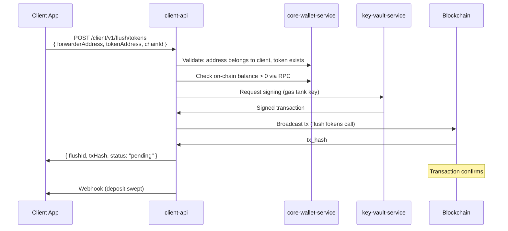
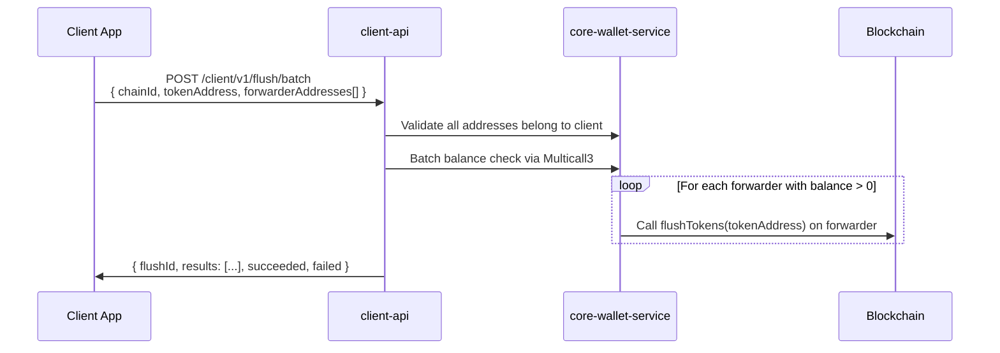
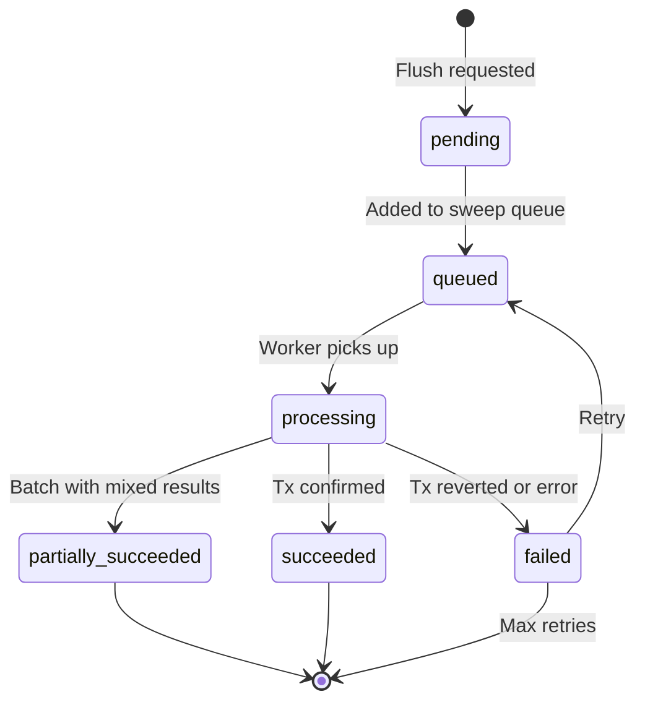

# CryptoVaultHub v2 -- Flush & Sweep Guide

Flush and sweep operations move funds from deposit addresses (forwarders) to the client's hot wallet. This is a critical financial operation that must be reliable, auditable, and gas-efficient.

---

## 1. Flush Tokens (ERC-20) vs Sweep Native

| Operation | Target | Smart Contract Method | Gas Paid By |
|-----------|--------|----------------------|-------------|
| **Flush Tokens** | ERC-20 tokens stuck in forwarder | `CvhForwarder.flushTokens(tokenAddress)` | Gas tank wallet |
| **Batch Flush Tokens** | Multiple ERC-20 tokens in one tx | `CvhForwarder.batchFlushERC20Tokens(address[])` | Gas tank wallet |
| **Sweep Native** | ETH/BNB/MATIC in forwarder | `CvhForwarder.flush()` | Gas tank wallet |

**Key difference:** Native currency (ETH) is auto-flushed on `receive()` when the forwarder is deployed and initialized. ERC-20 tokens require an explicit flush transaction because there is no `receive()` equivalent for token transfers.

### When Native Sweep is Needed

Even though the CvhForwarder auto-forwards ETH on receive, a manual sweep is needed when:
1. ETH was sent to the forwarder address **before** the contract was deployed (pre-deployment deposit)
2. ETH accumulated from gas refunds or dust
3. The auto-flush failed due to the parent wallet reverting

---

## 2. Manual Flush Flow



### Manual Flush Request

```bash
curl -X POST "http://localhost:3002/client/v1/flush/tokens" \
  -H "X-API-Key: cvh_live_xxx" \
  -H "Content-Type: application/json" \
  -d '{
    "chainId": 1,
    "forwarderAddress": "0x1a2b3c4d...",
    "tokenAddress": "0xdAC17F958D2ee523a2206206994597C13D831ec7"
  }'
```

---

## 3. Batch Flush Flow

Batch flush processes multiple forwarder addresses in optimized batches:



### Batch Flush Request

```bash
curl -X POST "http://localhost:3002/client/v1/flush/batch" \
  -H "X-API-Key: cvh_live_xxx" \
  -H "Content-Type: application/json" \
  -d '{
    "chainId": 1,
    "tokenAddress": "0xdAC17F958D2ee523a2206206994597C13D831ec7",
    "forwarderAddresses": [
      "0x1a2b3c4d...",
      "0x5e6f7a8b...",
      "0x9c0d1e2f..."
    ]
  }'
```

**Note:** The `CvhForwarder.batchFlushERC20Tokens(address[])` method can flush up to 255 tokens from a single forwarder in one transaction. For flushing the same token from multiple forwarders, each forwarder requires its own transaction (the `flushTokens` call is per-forwarder).

---

## 4. Dry-Run Simulation

Before executing a flush, you can simulate it to verify balances and estimate gas:

```bash
curl -X POST "http://localhost:3002/client/v1/flush/dry-run" \
  -H "X-API-Key: cvh_live_xxx" \
  -H "Content-Type: application/json" \
  -d '{
    "chainId": 1,
    "tokenAddress": "0xdAC17F958D2ee523a2206206994597C13D831ec7",
    "forwarderAddresses": ["0x1a2b3c4d...", "0x5e6f7a8b..."]
  }'
```

**Response:**

```json
{
  "success": true,
  "simulation": {
    "chainId": 1,
    "tokenSymbol": "USDT",
    "forwarders": [
      {
        "address": "0x1a2b3c4d...",
        "balance": "500.00",
        "balanceRaw": "500000000",
        "estimatedGas": 65000,
        "isDeployed": true
      },
      {
        "address": "0x5e6f7a8b...",
        "balance": "0",
        "balanceRaw": "0",
        "estimatedGas": 0,
        "isDeployed": true,
        "skipped": true,
        "reason": "Zero balance"
      }
    ],
    "totalAmount": "500.00",
    "totalEstimatedGas": 65000,
    "gasTankBalance": "0.5 ETH",
    "gasTankSufficient": true
  }
}
```

The dry-run:
- Checks on-chain balances for each forwarder
- Estimates gas cost per transaction
- Verifies gas tank has sufficient funds
- Verifies forwarder contracts are deployed
- Does **not** submit any transactions

---

## 5. Concurrency Protection (Redis Lock)

To prevent duplicate flush operations on the same address:

```
Lock key: flush:{chainId}:{forwarderAddress}
Lock TTL: 300 seconds (5 minutes)
```

**Behavior:**
- Before executing a flush, the service acquires a Redis lock for the forwarder address
- If the lock is already held, the request returns HTTP 409 (Conflict)
- The lock is released after the transaction is confirmed or after TTL expiry
- This prevents:
  - Two concurrent API calls flushing the same address
  - Automated sweep and manual flush colliding
  - Race conditions in batch operations

---

## 6. Status Lifecycle



| Status | Description |
|--------|-------------|
| `pending` | Flush request created, validation in progress |
| `queued` | Validated and added to the sweep BullMQ queue |
| `processing` | Transaction being signed and broadcast |
| `succeeded` | Transaction confirmed on-chain, funds moved to hot wallet |
| `failed` | Transaction reverted or could not be broadcast |
| `partially_succeeded` | Batch operation where some forwarders succeeded and others failed |

---

## 7. Smart Contract Interactions

### Single Token Flush

Calls `CvhForwarder.flushTokens(address tokenContractAddress)`:

```solidity
function flushTokens(address tokenContractAddress) external onlyAllowedAddress {
    ERC20Interface token = ERC20Interface(tokenContractAddress);
    uint256 balance = token.balanceOf(address(this));
    if (balance > 0) {
        TransferHelper.safeTransfer(tokenContractAddress, parentAddress, balance);
    }
}
```

**Who can call:** Only `parentAddress` (hot wallet) or `feeAddress` (gas tank).

### Batch Token Flush

Calls `CvhForwarder.batchFlushERC20Tokens(address[] calldata tokenContractAddresses)`:

```solidity
function batchFlushERC20Tokens(address[] calldata tokenContractAddresses) external onlyAllowedAddress {
    if (tokenContractAddresses.length > 255) revert TooManyTokens();
    for (uint256 i = 0; i < tokenContractAddresses.length;) {
        // flush each token
        unchecked { ++i; }
    }
}
```

**Limit:** 255 tokens per call.

### Native ETH Flush

Calls `CvhForwarder.flush()`:

```solidity
function flush() external onlyAllowedAddress {
    uint256 balance = address(this).balance;
    if (balance > 0) {
        (bool success, ) = parentAddress.call{value: balance}("");
        if (!success) revert FlushFailed();
    }
}
```

### Hot Wallet Token Flush (via CvhWalletSimple)

The hot wallet can also trigger flushes via:

```solidity
function flushForwarderTokens(
    address payable forwarderAddress,
    address tokenContractAddress
) external onlySigner {
    IForwarder(forwarderAddress).flushTokens(tokenContractAddress);
}
```

This is used by the platform when signing transactions from the multisig wallet.

---

## 8. Gas Estimation

Gas costs vary by operation and chain:

| Operation | Typical Gas (Ethereum) | Notes |
|-----------|----------------------|-------|
| `flush()` (native ETH) | ~30,000 | Simple ETH transfer |
| `flushTokens()` (single ERC-20) | ~65,000 | One `transfer` call |
| `batchFlushERC20Tokens(5)` | ~250,000 | 5 `transfer` calls |
| `batchFlushERC20Tokens(10)` | ~480,000 | 10 `transfer` calls |
| Forwarder deployment (EIP-1167 clone) | ~120,000 | CREATE2 + init |

**Gas estimation strategy:**

1. Estimate gas via `eth_estimateGas` with a 20% buffer
2. Use `eth_maxFeePerGas` for EIP-1559 chains or `eth_gasPrice` for legacy chains
3. Compare estimated cost against gas tank balance
4. If gas tank is insufficient, the operation is queued and retried when gas is available

---

## 9. Audit Trail

Every flush operation is recorded for complete traceability:

### Database Records

- `cvh_transactions.deposits` -- updated with `sweep_tx_hash` and `swept_at`
- `cvh_keyvault.key_vault_audit` -- signing operation recorded (who signed, tx hash, chain ID)
- `cvh_admin.audit_logs` -- if triggered via admin panel

### Redis Stream Events

- `deposits:swept` -- published after successful sweep, consumed by notification-service for webhook delivery

### What is Logged

| Field | Description |
|-------|-------------|
| Chain ID | Which blockchain |
| Client ID | Which client |
| Forwarder addresses | Which deposit addresses were flushed |
| Token address/symbol | Which token was flushed |
| Amount | Total amount flushed |
| Tx hash | On-chain transaction hash |
| Gas cost | Gas consumed |
| Initiated by | API key ID or system (cron) |
| Timestamp | When the operation was executed |

---

## 10. Automated Sweep (Cron Worker)

The `cron-worker-service` runs automated sweeps via the `sweep` BullMQ queue:

**Source:** `services/cron-worker-service/src/sweep/sweep.service.ts`

**Schedule:** Repeatable job every 60 seconds per (chain, client) pair.

**Flow:**
1. Query `cvh_transactions.deposits` where `status = 'confirmed'` AND `sweep_tx_hash IS NULL`
2. Group deposits by token
3. For each token, identify forwarder addresses with balance > 0
4. Execute `flushTokens()` for each forwarder
5. Update deposit records with sweep tx hash and timestamp
6. Publish `deposits:swept` event to Redis Stream

**Configuration:** `SWEEP_INTERVAL_MS` environment variable (default: 60000).

The automated sweep only processes deposits that have been confirmed (reached the required confirmation threshold). It does not process pending deposits.
