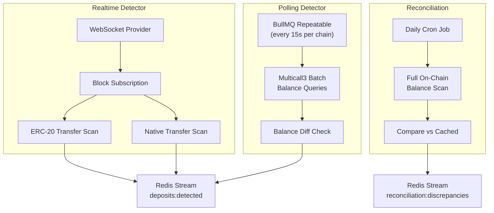
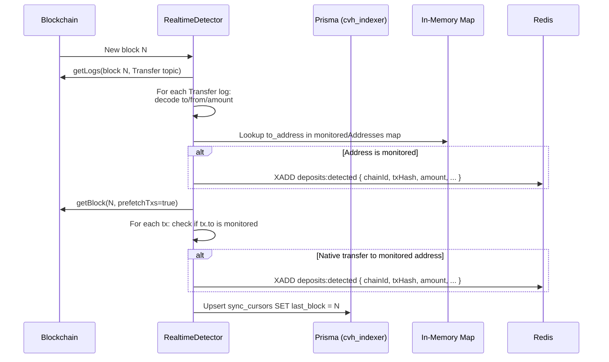

# CryptoVaultHub v2 -- Chain Indexer Guide

The Chain Indexer Service (`services/chain-indexer-service/`, port 3006) is responsible for detecting deposits to forwarder addresses, tracking confirmations, and maintaining balance caches. It uses a hybrid polling + WebSocket approach for maximum reliability and low latency.

---

## 1. How the Indexer Works

The indexer operates three concurrent subsystems:



### Detection Priority

1. **Realtime Detector** (preferred): WebSocket subscription to new blocks. Provides near-instant detection (within 1-2 seconds of block inclusion). Falls back gracefully if WS connection fails.

2. **Polling Detector** (fallback): BullMQ repeatable job every 15 seconds per chain. Uses Multicall3 to batch-query all monitored address balances in a single RPC call. Detects deposits by comparing current balance to cached previous balance.

3. **Reconciliation** (safety net): Daily deep scan that compares all on-chain balances against cached values. Catches anything missed by the other two detectors.

---

## 2. Block Processing Flow

When a new block arrives (via WS or polling):



### Key Implementation Details

**Source:** `services/chain-indexer-service/src/realtime-detector/realtime-detector.service.ts`

- Monitored addresses are loaded into an in-memory `Map<string, {clientId, walletId}>` at startup
- Lookup key format: `${chainId}:${address.toLowerCase()}`
- The map is refreshed when `refreshMonitoredAddresses()` is called (e.g., when new deposit addresses are created)
- ERC-20 transfers are detected via `Transfer(address,address,uint256)` event topic filtering
- Native ETH transfers are detected by iterating all transactions in the block

---

## 3. Gap Detection Mechanism

Block gaps can occur when:
- The indexer service restarts
- WebSocket connection drops temporarily
- RPC provider returns errors for specific blocks

**Detection:**

The `sync_cursors` table stores the last processed block per chain. On startup, the indexer:

1. Reads `sync_cursors.last_block` for the chain
2. Gets the current chain head block number
3. If `(head - last_block) > 1`, processes all missed blocks sequentially

**Gap processing is synchronous** to maintain ordering guarantees. The polling detector continues running in parallel.

---

## 4. Backfill Process

Backfill is used to reprocess a range of historical blocks, typically after:
- Adding a new chain to the platform
- Discovering a gap that was not auto-detected
- Adding new tokens to monitor

**Triggering backfill:**

```bash
# Via admin API (v2)
curl -X POST -H "Authorization: Bearer $TOKEN" \
  -H "Content-Type: application/json" \
  -d '{"chainId": 1, "fromBlock": 19500000, "toBlock": 19500100}' \
  "http://localhost:3001/admin/sync/backfill"
```

**Backfill processes blocks in batches** (typically 10-50 blocks per batch) to avoid overwhelming the RPC provider. Each batch is processed sequentially within the batch but multiple batches can be queued.

---

## 5. Finality Thresholds

Deposits are not considered final until reaching the required confirmation count. These are configured per chain in the `chains` table (`confirmations_default`) and can be overridden per client in `client_chain_config`.

| Chain | Chain ID | Block Time | Default Confirmations | Approx. Finality Time |
|-------|----------|-----------|----------------------|----------------------|
| Ethereum Mainnet | 1 | 12s | 12 | ~2.4 min |
| BNB Smart Chain | 56 | 3s | 20 | ~1 min |
| Polygon PoS | 137 | 2s | 30 | ~1 min |
| Arbitrum One | 42161 | 1s | 20 | ~20s |
| OP Mainnet | 10 | 2s | 20 | ~40s |
| Avalanche C-Chain | 43114 | 2s | 20 | ~40s |
| Base | 8453 | 2s | 20 | ~40s |

**Client override example:**
```sql
-- Set Polygon to 64 confirmations for client 42
INSERT INTO cvh_admin.client_chain_config (client_id, chain_id, confirmations)
VALUES (42, 137, 64)
ON DUPLICATE KEY UPDATE confirmations = 64;
```

---

## 6. Reorg Handling

Chain reorganizations (reorgs) can invalidate previously confirmed transactions.

### Detection

The confirmation tracker monitors block hashes. If a previously seen block hash changes at the same height, a reorg is detected.

### Response

1. All deposits from reorged blocks are marked as `pending` with confirmations reset to 0
2. The sync cursor is rolled back to the fork point
3. Blocks from the fork point are reprocessed
4. Any sweep transactions that referenced reorged deposits are flagged for review

### Practical Impact

- Reorgs deeper than the confirmation threshold are extremely rare (the whole point of the threshold)
- Shallow reorgs (1-3 blocks) are handled automatically
- Deep reorgs (> 10 blocks) trigger a compliance alert

---

## 7. Balance Materialization

Balances are materialized in Redis for fast lookup and change detection:

**Cache key pattern:** `balance:{chainId}:{address}:{tokenAddress|'native'}`

**TTL:** 3600 seconds (1 hour)

**Update triggers:**
1. Polling detector updates on every poll cycle (15s)
2. Realtime detector does NOT update the cache (it detects via event logs, not balance queries)
3. Reconciliation service updates the cache after verifying on-chain

**Important:** The cached balance is the **on-chain balance** of the forwarder address, not the amount credited to the client. After a deposit is swept, the forwarder balance drops to zero but the deposit record in `cvh_transactions.deposits` retains the original amount.

### Multicall3 Batch Queries

The polling detector uses Multicall3 to batch all balance queries into a single RPC call:

```
For each monitored address:
  - 1 call for native balance (getEthBalance)
  - N calls for ERC-20 balances (balanceOf per token)

Total calls per poll = addresses * (1 + active_token_count)
```

**Source:** `services/chain-indexer-service/src/polling-detector/polling-detector.service.ts`

---

## 8. Sync Health Monitoring

The admin API provides sync health metrics via `GET /admin/monitoring/health` and the v2 `GET /admin/sync/health` endpoint.

### Severity Levels

| Severity | Condition | Action |
|----------|-----------|--------|
| **Healthy** | Lag < 10 blocks | Normal operation |
| **Warning** | Lag 10-100 blocks | Investigate RPC health |
| **Degraded** | Lag 100-1000 blocks | Check WS connection, consider adding RPC providers |
| **Critical** | Lag > 1000 blocks | Service may have crashed; restart and backfill |
| **Stale** | `sync_cursors.updated_at` > 5 min ago | Service is not processing; check container health |

### Monitoring Queries

```sql
-- Sync lag per chain (requires knowing current block from RPC)
SELECT
  sc.chain_id,
  c.name,
  sc.last_block,
  sc.updated_at,
  TIMESTAMPDIFF(SECOND, sc.updated_at, NOW()) as seconds_since_update
FROM cvh_indexer.sync_cursors sc
JOIN cvh_admin.chains c ON c.chain_id = sc.chain_id
WHERE c.is_active = 1
ORDER BY seconds_since_update DESC;

-- Monitored address count per chain
SELECT chain_id, COUNT(*) as address_count
FROM cvh_indexer.monitored_addresses
WHERE is_active = 1
GROUP BY chain_id;
```

---

## 9. Recovery Procedures

### Service Restart Recovery

On startup, the indexer:
1. Loads all monitored addresses into memory
2. Reads `sync_cursors` for each active chain
3. Starts WebSocket subscriptions (with fallback to polling)
4. Processes any blocks between `last_block` and current head
5. Resumes normal operation

### "Death Certificate" Mechanism

If the indexer detects that it has been down for an extended period (> 1000 blocks behind on any chain), it enters a recovery mode:

1. Logs a "death certificate" event with the gap details
2. Switches to batch processing mode (larger block ranges per RPC call)
3. Disables WebSocket subscriptions temporarily (polling only)
4. Processes missed blocks in order
5. Once caught up (< 10 blocks behind), re-enables WebSocket and resumes normal mode

This prevents the realtime detector from consuming resources on blocks that the service already needs to catch up on.

### Manual Recovery

```bash
# 1. Check current sync status
curl -H "Authorization: Bearer $TOKEN" \
  "http://localhost:3001/admin/sync/status"

# 2. If gaps are detected, trigger backfill
curl -X POST -H "Authorization: Bearer $TOKEN" \
  -H "Content-Type: application/json" \
  -d '{"chainId": 1, "fromBlock": 19500000, "toBlock": 19501000}' \
  "http://localhost:3001/admin/sync/backfill"

# 3. Monitor progress
curl -H "Authorization: Bearer $TOKEN" \
  "http://localhost:3001/admin/sync/status"
```

---

## 10. Performance Considerations

### High-Throughput Chains

For chains with fast block times (Arbitrum at ~1s, Polygon at ~2s) and many monitored addresses:

| Factor | Recommendation |
|--------|---------------|
| **Monitored addresses** | Up to 10,000 per chain with Multicall3 batching |
| **Tokens per chain** | Each additional token adds 1 RPC sub-call per address |
| **Polling interval** | Keep at 15s minimum; faster polling hits rate limits |
| **WebSocket** | Essential for chains with < 5s block time |
| **Memory** | In-memory address map uses ~1KB per address |
| **RPC provider** | Use a dedicated/paid node for high-throughput chains |

### Scaling Strategies

1. **Vertical:** Increase memory for the chain-indexer-service container to hold more addresses in memory
2. **Horizontal (per-chain):** Deploy separate indexer instances per chain, each with its own `sync_cursors` and `monitored_addresses` scope
3. **RPC tier:** Upgrade to archive nodes or dedicated infrastructure for chains with >5000 monitored addresses
4. **Polling batching:** Multicall3 supports up to ~500 calls per batch. For >500 addresses per chain, the polling detector automatically chunks into multiple Multicall3 calls.

### RPC Call Budget

Per chain per polling cycle:

```
Calls = ceil(addresses * (1 + erc20_tokens) / 500)  // Multicall3 batches
     + 1                                              // getBlockNumber
```

For 1,000 addresses and 5 ERC-20 tokens:
```
Calls = ceil(1000 * 6 / 500) = 12 Multicall3 calls + 1 = 13 RPC calls per 15s
= ~52 RPC calls per minute per chain
```
