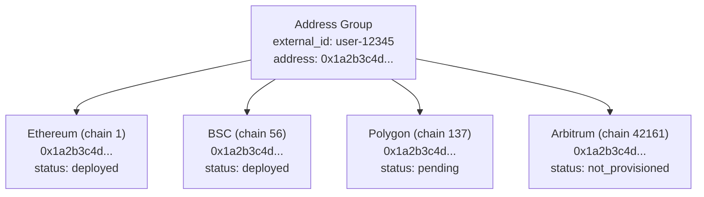
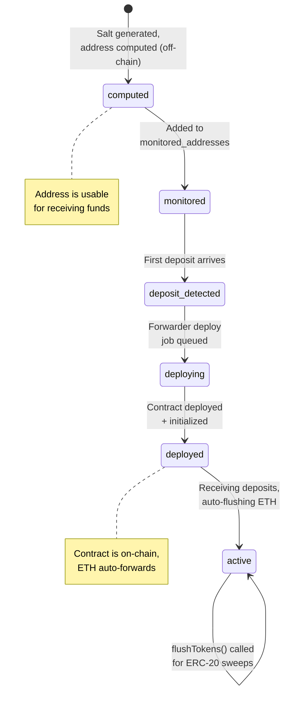

# CryptoVaultHub v2 -- Multi-Chain Address Guide

CryptoVaultHub generates **deterministic deposit addresses** using the EVM CREATE2 opcode. This allows addresses to be computed off-chain before contract deployment and reproduced identically across multiple EVM chains.

---

## 1. How CREATE2 Deterministic Addresses Work

The CREATE2 opcode computes a contract address from four inputs:

```
address = keccak256(0xff ++ deployer ++ salt ++ keccak256(bytecode))[12:]
```

| Input | Source in CVH |
|-------|--------------|
| `0xff` | Fixed prefix (EVM specification) |
| `deployer` | CvhForwarderFactory contract address |
| `salt` | `keccak256(abi.encodePacked(caller, parentWallet, feeAddress, userSalt))` |
| `bytecode` | EIP-1167 minimal proxy bytecode pointing to CvhForwarder implementation |

### Why CREATE2?

1. **Pre-computation:** The deposit address is known immediately after salt generation, before any on-chain transaction. Clients can display the address to their users right away.

2. **Deferred deployment:** The forwarder contract is only deployed when the first deposit arrives, saving gas for addresses that never receive funds.

3. **Deterministic across chains:** If the same factory, implementation, parent wallet, fee address, and salt are used on multiple chains, the resulting address is identical.

### Implementation

**Factory contract:** `contracts/contracts/CvhForwarderFactory.sol`

```solidity
function createForwarder(
    address parent,
    address feeAddress,
    bytes32 salt,
    bool _autoFlush721,
    bool _autoFlush1155
) external returns (address payable forwarder) {
    bytes32 finalSalt = keccak256(abi.encodePacked(msg.sender, parent, feeAddress, salt));
    forwarder = createClone(implementationAddress, finalSalt);
    CvhForwarder(payable(forwarder)).init(parent, feeAddress, _autoFlush721, _autoFlush1155);
    emit ForwarderCreated(forwarder, parent, feeAddress);
}

function computeForwarderAddress(
    address deployer,
    address parent,
    address feeAddress,
    bytes32 salt
) external view returns (address) {
    bytes32 finalSalt = keccak256(abi.encodePacked(deployer, parent, feeAddress, salt));
    return computeCloneAddress(implementationAddress, finalSalt);
}
```

**Off-chain computation:** The `core-wallet-service` computes the address using ethers.js without making an RPC call:

```typescript
// Simplified address computation
const finalSalt = ethers.solidityPackedKeccak256(
  ['address', 'address', 'address', 'bytes32'],
  [callerAddress, parentWallet, feeAddress, userSalt],
);
const initCodeHash = ethers.solidityPackedKeccak256(
  ['bytes', 'bytes20', 'bytes'],
  [EIP1167_PREFIX, implementationAddress, EIP1167_SUFFIX],
);
const address = ethers.getCreate2Address(
  factoryAddress,
  finalSalt,
  initCodeHash,
);
```

---

## 2. How the Same Address is Achieved Across Multiple EVM Chains

For a forwarder address to be identical on Chain A and Chain B, the following must be the same on both chains:

| Parameter | Requirement |
|-----------|-------------|
| **CvhForwarderFactory address** | Must be deployed at the same address on both chains |
| **CvhForwarder implementation address** | Must be deployed at the same address on both chains |
| **Parent wallet address** | Same hot wallet address (or same CREATE2-derived wallet) |
| **Fee address** | Same gas tank address |
| **Salt** | Same user-provided salt |
| **Caller address** | Same address calling `createForwarder` |

### Achieving Identical Factory Addresses

The factory contracts are deployed using a **deterministic deployment proxy** (e.g., Nick's method or CREATE2 from a common deployer). This ensures the factory gets the same address on every chain.

**Prerequisite:** The factory and implementation contracts must be deployed on each target chain before addresses can be generated. The addresses are stored in the `chains` table:

```sql
-- Chain configuration in cvh_admin.chains
wallet_factory_address    -- CvhWalletFactory address on this chain
forwarder_factory_address -- CvhForwarderFactory address on this chain
wallet_impl_address       -- CvhWalletSimple implementation address
forwarder_impl_address    -- CvhForwarder implementation address
```

---

## 3. Address Groups Concept

An **Address Group** (v2) represents a single deposit address identity that spans multiple chains. One address group generates the same deterministic address on every provisioned chain.



**Benefits:**
- A single address can receive deposits on multiple chains
- Clients give their users one address that works everywhere
- Simplifies address management and display

**Data model:**
- `address_groups` table: group metadata (client_id, external_id, address, salt)
- `address_group_chains` table: per-chain provisioning status (chain_id, is_deployed, deployed_at)

---

## 4. Provisioning Flow

### Step 1: Create Address Group

```bash
curl -X POST "http://localhost:3002/client/v1/address-groups" \
  -H "X-API-Key: cvh_live_xxx" \
  -H "Content-Type: application/json" \
  -d '{
    "externalId": "user-12345",
    "label": "John Doe deposit address",
    "chains": [1, 56, 137]
  }'
```

**Response:**
```json
{
  "success": true,
  "addressGroup": {
    "id": "ag_01HX...",
    "externalId": "user-12345",
    "address": "0x1a2b3c4d5e6f7890abcdef1234567890abcdef12",
    "label": "John Doe deposit address",
    "chains": [
      { "chainId": 1, "status": "pending_deployment" },
      { "chainId": 56, "status": "pending_deployment" },
      { "chainId": 137, "status": "pending_deployment" }
    ],
    "createdAt": "2026-04-09T10:00:00Z"
  }
}
```

### Step 2: Address is Usable Immediately

The address `0x1a2b3c4d...` can receive deposits on all three chains right away, even before the forwarder contracts are deployed. The chain indexer monitors the address across all provisioned chains.

### Step 3: Forwarder Deployment (Automatic)

When the first deposit is detected on a chain:
1. `cron-worker-service` picks up the `forwarder-deploy` job
2. Calls `CvhForwarderFactory.createForwarder(...)` on that chain
3. Updates `address_group_chains.is_deployed = true`
4. Updates `deposit_addresses.is_deployed = true`

### Step 4: Provision Additional Chains

```bash
curl -X POST "http://localhost:3002/client/v1/address-groups/{id}/provision" \
  -H "X-API-Key: cvh_live_xxx" \
  -H "Content-Type: application/json" \
  -d '{ "chains": [42161, 10] }'
```

This adds Arbitrum and Optimism to the address group. The same address is used on these chains because the CREATE2 inputs are identical.

---

## 5. Factory Deployment Prerequisite

Before any deposit address can be generated on a chain, the following contracts must be deployed:

| Contract | Stored In | Required For |
|----------|-----------|-------------|
| CvhForwarder (implementation) | `chains.forwarder_impl_address` | Address computation |
| CvhForwarderFactory | `chains.forwarder_factory_address` | Address computation + deployment |
| CvhWalletSimple (implementation) | `chains.wallet_impl_address` | Hot wallet deployment |
| CvhWalletFactory | `chains.wallet_factory_address` | Hot wallet deployment |

### Deployment Checklist for a New Chain

1. Deploy CvhForwarder implementation contract
2. Deploy CvhForwarderFactory with the implementation address
3. Deploy CvhWalletSimple implementation contract
4. Deploy CvhWalletFactory with the implementation address
5. Deploy CvhBatcher (optional, for batch operations)
6. Register the chain in `cvh_admin.chains` with all contract addresses
7. Verify `multicall3_address` is correct (standard: `0xcA11bde05977b3631167028862bE2a173976CA11`)

### Verifying Factory Deployment

```bash
# Check chain config
curl -H "Authorization: Bearer $TOKEN" \
  "http://localhost:3001/admin/chains" | jq '.chains[] | select(.chainId == 1)'
```

If `forwarder_factory_address` or `forwarder_impl_address` is NULL, the chain is not ready for deposit address generation.

---

## 6. Security Considerations

### Address Prediction Safety

- The CREATE2 address can be predicted by anyone who knows the inputs. This is by design -- it allows off-chain address computation.
- The forwarder contract, once deployed, can only send funds to the `parentAddress` (hot wallet) and can only be controlled by `parentAddress` or `feeAddress`.
- An attacker who predicts the address cannot extract funds because the contract is not deployed yet, and once deployed, only authorized parties can call `flush`.

### Pre-Deployment Deposit Safety

- Funds sent to a CREATE2 address before the contract is deployed are safe.
- When the forwarder is eventually deployed and `init()` is called, the constructor auto-flushes any existing ETH balance.
- ERC-20 tokens deposited pre-deployment remain in the address until `flushTokens()` is explicitly called after deployment.

### Front-Running Protection

- The `finalSalt` includes the `msg.sender` (caller) address, preventing other parties from deploying a different forwarder at the predicted address.
- The `init()` function can only be called once (`AlreadyInitialized()` error on re-init), preventing re-initialization attacks.

### Key Isolation

- The forwarder's `parentAddress` is the client's CvhWalletSimple (2-of-3 multisig).
- The `feeAddress` is the gas tank wallet (used for operational transactions).
- Neither address holds private keys in the forwarder contract -- keys are managed by the key-vault-service.

### Chain-Specific Risks

| Risk | Mitigation |
|------|-----------|
| Different gas costs per chain | Dry-run simulation before batch operations |
| Factory not deployed on target chain | Check `chains.forwarder_factory_address` before address generation |
| Multicall3 not available | All supported chains have Multicall3 at the standard address |
| Chain reorg invalidates deployment tx | Confirmation threshold before marking as deployed |

---

## 7. Address Lifecycle Summary


