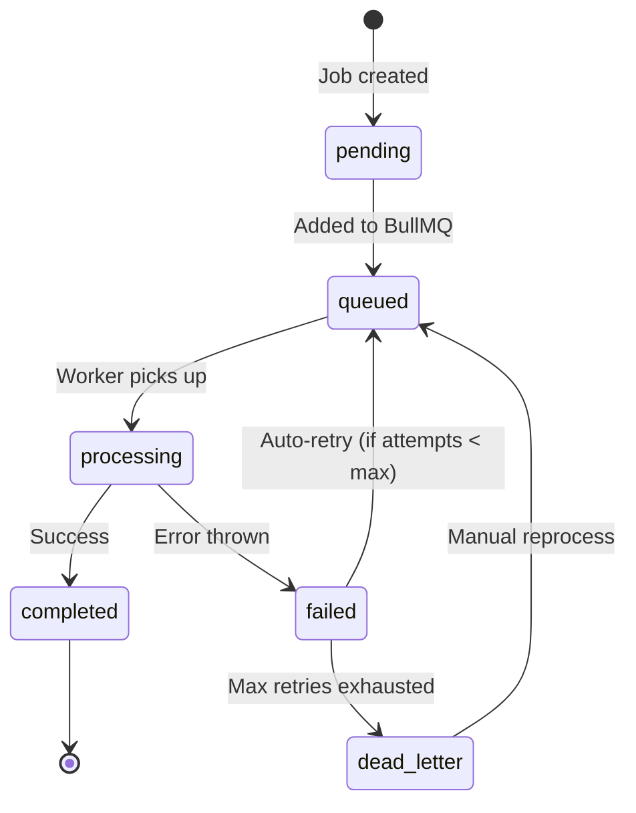

# CryptoVaultHub v2 -- Queue & Job System Guide

CVH uses **BullMQ** (backed by Redis 7) for all asynchronous job processing. Redis Streams are used for event-driven inter-service communication.

---

## 1. Queue Topology

### BullMQ Queues

| Queue Name | Service | Priority | Purpose |
|-----------|---------|----------|---------|
| `polling-detector` | chain-indexer-service | High | Cron-based balance polling per chain (Multicall3 batch) |
| `deposit-detection` | core-wallet-service | High | Process detected deposits from Redis Stream |
| `withdrawal-processing` | core-wallet-service | High | Sign and broadcast withdrawal transactions |
| `forwarder-deploy` | cron-worker-service | Medium | Deploy forwarder contracts on-chain |
| `sweep` | cron-worker-service | Medium | Sweep/flush confirmed deposits from forwarders to hot wallet |
| `webhook-delivery` | notification-service | Medium | Deliver webhook payloads to client endpoints |
| `sanctions-sync` | cron-worker-service | Low | Sync OFAC/EU/UN sanctions lists |
| `gas-tank-monitor` | cron-worker-service | Low | Monitor gas tank balances, trigger top-ups |

### Redis Streams (Event Bus)

| Stream Name | Producer | Consumer(s) | Purpose |
|-------------|----------|-------------|---------|
| `deposits:detected` | chain-indexer-service | core-wallet-service | Raw deposit detection events |
| `deposits:pending` | core-wallet-service | notification-service | Deposit recorded, pending confirmation |
| `deposits:confirmed` | core-wallet-service | notification-service, cron-worker-service | Deposit confirmed, ready for sweep |
| `deposits:swept` | cron-worker-service | notification-service | Sweep completed |
| `reconciliation:discrepancies` | chain-indexer-service | admin-api (alerts) | Balance discrepancy alerts |

---

## 2. Job Lifecycle



| Status | Description |
|--------|-------------|
| `pending` | Job record created but not yet queued |
| `queued` | In BullMQ waiting queue |
| `processing` | Worker is actively processing |
| `completed` | Successfully finished |
| `failed` | Last attempt failed (may auto-retry) |
| `dead_letter` | All retries exhausted, requires manual intervention |

---

## 3. Idempotency via job_uid

Every job carries a unique identifier (`job_uid`) that prevents duplicate processing:

```typescript
// Example: Sweep job
await this.sweepQueue.add(
  'execute-sweep',
  { chainId: 1, clientId: 42 },
  {
    jobId: `sweep-1-42`,      // Unique per chain+client
    repeat: { every: 60_000 }, // Repeatable
  },
);
```

**Rules:**
- BullMQ enforces `jobId` uniqueness within the queue
- Repeatable jobs use the same `jobId` across iterations
- Non-repeatable jobs (e.g., one-off flushes) generate a UUID-based `jobId`
- The `job_uid` is stored in the jobs database (v2) for audit purposes

---

## 4. Deduplication Strategy

Deduplication happens at multiple levels:

1. **Queue level:** BullMQ `jobId` prevents the same job from being queued twice
2. **Database level:** Unique constraints prevent duplicate records (e.g., `uq_tx_forwarder` on deposits)
3. **Redis level:** Idempotency keys in Redis with TTL (e.g., `withdrawal:idempotency:<key>`)
4. **Application level:** Services check for existing records before creating new ones

Example: The polling detector uses `jobId: 'poll-chain-${chainId}'` with a repeatable schedule, so BullMQ automatically manages the lifecycle and prevents overlapping executions.

---

## 5. Dead Letter Queue Management

When a job exhausts all retry attempts, it moves to the dead letter state.

### Viewing Dead Letter Jobs

```bash
# Via admin API
curl -H "Authorization: Bearer $TOKEN" \
  "http://localhost:3001/admin/jobs/dead-letter"
```

### Investigating Dead Letter Jobs

Each dead letter entry includes:
- Original job payload
- All attempt timestamps and error messages
- Queue name and chain context
- Failure classification (transient vs. permanent)

### Reprocessing Dead Letter Jobs

```bash
# Reprocess a single job
curl -X POST -H "Authorization: Bearer $TOKEN" \
  "http://localhost:3001/admin/jobs/dead-letter/{id}/reprocess"

# Batch reprocess by queue name
curl -X POST -H "Authorization: Bearer $TOKEN" \
  -d '{"queue": "sweep", "filter": "chain_id=1"}' \
  "http://localhost:3001/admin/jobs/batch-retry"
```

**Important:** Before reprocessing, verify the root cause is resolved. Common reasons for dead letter:
- Gas tank depleted (sweep/deploy jobs)
- RPC provider down (all blockchain-related jobs)
- Client webhook endpoint permanently removed (webhook delivery)

---

## 6. Retry Strategies

Each queue has a configurable retry strategy:

| Queue | Strategy | Config | Max Attempts |
|-------|----------|--------|-------------|
| `polling-detector` | Fixed interval | Repeatable every 15s | N/A (repeatable) |
| `deposit-detection` | Exponential | 2^attempt * 1000ms | 10 |
| `withdrawal-processing` | Exponential | 2^attempt * 2000ms | 5 |
| `forwarder-deploy` | Exponential | 2^attempt * 5000ms | 8 |
| `sweep` | Fixed interval | Repeatable every 60s | N/A (repeatable, errors logged) |
| `webhook-delivery` | Exponential | 1s, 4s, 16s, 64s, 256s | 5 |
| `sanctions-sync` | Linear | 30s between retries | 3 |
| `gas-tank-monitor` | Fixed interval | Repeatable every 5min | N/A (repeatable) |

### Retry Strategy Details

**Exponential backoff:**
```
delay = baseDelay * (2 ^ attemptNumber)
```

**Linear backoff:**
```
delay = baseDelay * attemptNumber
```

**Fixed interval:** Repeatable BullMQ jobs that run on a schedule. If an execution fails, the next scheduled run proceeds normally.

### Configuring Retry Behavior

```typescript
// BullMQ job options
{
  attempts: 5,
  backoff: {
    type: 'exponential',  // 'exponential' | 'fixed'
    delay: 1000,          // base delay in ms
  },
  removeOnComplete: { count: 1000 },  // keep last 1000 completed
  removeOnFail: { count: 5000 },      // keep last 5000 failed
}
```

---

## 7. Rate Limiting per Chain/Provider

RPC calls are rate-limited to prevent exceeding provider quotas:

| Provider | Default Rate | Configurable |
|----------|-------------|-------------|
| Tatum.io (free) | 5 req/s | Via `TATUM_API_KEY` plan |
| Tatum.io (paid) | 50 req/s | Via plan |
| Infura | 10 req/s | Via plan |
| Custom RPC | Unlimited | Configure in chain's `rpc_endpoints` JSON |

The `EvmProviderService` tracks success/failure per chain and reports metrics to Prometheus. Failed providers are temporarily deprioritized.

---

## 8. Admin Job Dashboard

The admin API exposes endpoints for monitoring and managing jobs:

### Viewing Queue Status

`GET /admin/monitoring/queues` returns:

```json
{
  "queues": [
    {
      "name": "deposit-detection",
      "waiting": 12,
      "active": 3,
      "completed": 45230,
      "failed": 2,
      "delayed": 0,
      "workers": 4,
      "avgProcessingTime": "250ms"
    }
  ]
}
```

### Viewing Individual Jobs

`GET /admin/jobs/:id` returns the full job record including:
- Original payload
- Current status
- All attempt timestamps and results
- Error messages and stack traces
- Queue and worker metadata

---

## 9. How to Reprocess Failed Jobs

### Single Job Retry

```bash
curl -X POST -H "Authorization: Bearer $TOKEN" \
  "http://localhost:3001/admin/jobs/{jobId}/retry"
```

This moves the job back to `queued` status with a fresh attempt counter.

### Batch Retry

```bash
curl -X POST -H "Authorization: Bearer $TOKEN" \
  -H "Content-Type: application/json" \
  -d '{
    "queue": "forwarder-deploy",
    "status": "failed",
    "chainId": 1,
    "maxJobs": 100
  }' \
  "http://localhost:3001/admin/jobs/batch-retry"
```

### When to Retry vs. Investigate

| Scenario | Action |
|----------|--------|
| Gas tank empty | Refill gas tank first, then batch retry |
| RPC provider down | Wait for provider recovery, then batch retry |
| Contract revert | Investigate the specific error before retrying |
| Client webhook 404 | Contact client, they may need to update webhook URL |
| Database deadlock | Usually resolves on auto-retry, investigate if persistent |

---

## 10. How to Manually Create Jobs

For operational tasks that need to be queued manually:

### Trigger a Manual Sweep

```bash
# Via admin API
curl -X POST -H "Authorization: Bearer $TOKEN" \
  -H "Content-Type: application/json" \
  -d '{"chainId": 1, "clientId": 42}' \
  "http://localhost:3001/admin/jobs" \
  --data '{"queue": "sweep", "data": {"chainId": 1, "clientId": 42}}'
```

### Trigger Manual Sanctions Sync

```bash
curl -X POST -H "Authorization: Bearer $TOKEN" \
  "http://localhost:3001/admin/jobs" \
  --data '{"queue": "sanctions-sync", "data": {"force": true}}'
```

### Trigger Manual Forwarder Deployment

This is typically triggered automatically when the first deposit is detected at an undeployed forwarder address, but can be forced:

```bash
curl -X POST -H "Authorization: Bearer $TOKEN" \
  -H "Content-Type: application/json" \
  -d '{"queue": "forwarder-deploy", "data": {"chainId": 1, "addressId": 123}}' \
  "http://localhost:3001/admin/jobs"
```
