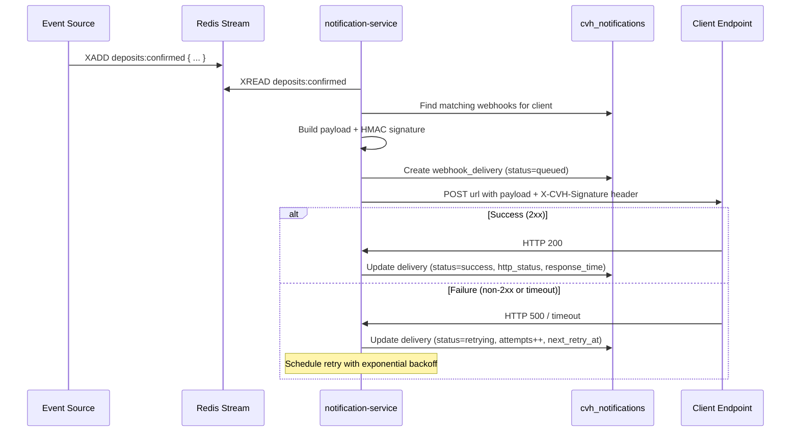

# CryptoVaultHub v2 -- Webhook System Guide

The webhook system delivers real-time event notifications to client-configured HTTP endpoints with HMAC-SHA256 signing, automatic retries, and delivery audit logging.

**Primary service:** `services/notification-service/` (port 3007)

---

## 1. Webhook Configuration

### Creating a Webhook

```bash
curl -X POST "http://localhost:3002/client/v1/webhooks" \
  -H "X-API-Key: cvh_live_xxx" \
  -H "Content-Type: application/json" \
  -d '{
    "url": "https://myapp.com/webhooks/cvh",
    "events": ["deposit.confirmed", "deposit.swept", "withdrawal.confirmed"],
    "label": "Production deposits"
  }'
```

**Response:**
```json
{
  "success": true,
  "webhook": {
    "id": "wh_01HX...",
    "url": "https://myapp.com/webhooks/cvh",
    "events": ["deposit.confirmed", "deposit.swept", "withdrawal.confirmed"],
    "secret": "a1b2c3d4e5f6...96_hex_chars",
    "isActive": true,
    "createdAt": "2026-04-09T10:00:00Z"
  }
}
```

**Important:** The `secret` is only returned at creation time. Store it securely -- it is used to verify webhook signatures.

### Supported Events

| Event | Trigger |
|-------|---------|
| `deposit.detected` | Deposit transaction seen on-chain (unconfirmed) |
| `deposit.confirmed` | Deposit reached required confirmations |
| `deposit.swept` | Funds swept from forwarder to hot wallet |
| `withdrawal.submitted` | Withdrawal broadcast to the network |
| `withdrawal.confirmed` | Withdrawal confirmed on-chain |
| `withdrawal.failed` | Withdrawal transaction failed |
| `forwarder.deployed` | Forwarder contract deployed on-chain |
| `test.ping` | Manual test delivery |

### Wildcard Subscriptions

- `deposit.*` -- all deposit events
- `withdrawal.*` -- all withdrawal events
- `*` -- all events

### Per-Webhook Configuration

| Field | Type | Default | Description |
|-------|------|---------|-------------|
| `url` | string | required | HTTPS endpoint URL |
| `events` | string[] | required | Event types to subscribe to |
| `label` | string | null | Human-readable label |
| `isActive` | boolean | true | Enable/disable without deleting |

### Limits

- Maximum **10 webhook endpoints** per client (governed by tier's `max_webhooks`)
- URL must be unique per client (no duplicate URLs)
- URL should be HTTPS in production

---

## 2. Delivery Flow



### Delivery Payload Format

```json
{
  "eventId": "evt_01HX4N8B2K3M5P7Q9R1S",
  "eventType": "deposit.confirmed",
  "timestamp": "2026-04-09T10:02:24Z",
  "data": {
    "depositId": "dep_01HX...",
    "chainId": 1,
    "chainName": "Ethereum",
    "depositAddress": "0x1a2b3c4d...",
    "tokenSymbol": "USDT",
    "tokenAddress": "0xdAC17F958D2ee523a2206206994597C13D831ec7",
    "amount": "1000.00",
    "txHash": "0x4e3a3754e196b8c8123...",
    "blockNumber": 19500000,
    "confirmations": 12,
    "requiredConfirmations": 12,
    "fromAddress": "0x9876543210abcdef...",
    "status": "confirmed"
  }
}
```

### HTTP Headers Sent

| Header | Value |
|--------|-------|
| `Content-Type` | `application/json` |
| `X-CVH-Signature` | HMAC-SHA256 hex digest |
| `X-CVH-Event` | Event type (e.g., `deposit.confirmed`) |
| `X-CVH-Delivery-Id` | Unique delivery ID |
| `User-Agent` | `CryptoVaultHub-Webhook/2.0` |

---

## 3. Retry Strategies

### Default Strategy: Exponential Backoff

| Attempt | Delay | Cumulative Time |
|---------|-------|----------------|
| 1 | Immediate | 0s |
| 2 | 1s | 1s |
| 3 | 4s | 5s |
| 4 | 16s | 21s |
| 5 | 64s | 85s |

If all 5 attempts fail, the delivery is marked as `failed`.

### v2 Enhanced Retry Configuration

Webhooks in v2 support configurable retry strategies per endpoint:

| Strategy | Formula | Use Case |
|----------|---------|----------|
| `exponential` | `delay * 2^attempt` | Default, good for transient failures |
| `linear` | `delay * attempt` | Steady spacing |
| `fixed` | `delay` | Constant interval |

### Retry Conditions

| HTTP Status | Behavior |
|-------------|----------|
| `2xx` | Success -- delivery complete |
| `3xx` | Treated as success (redirects followed) |
| `4xx` (except 429) | **Fatal** -- no retry (client error) |
| `429` | **Retryable** -- respect `Retry-After` header if present |
| `5xx` | **Retryable** -- server error, exponential backoff |
| Connection refused | **Retryable** |
| Timeout (30s) | **Retryable** |
| DNS resolution failure | **Retryable** |

---

## 4. Attempt Recording

Each delivery attempt is fully recorded in the `webhook_deliveries` table:

| Field | Description |
|-------|-------------|
| `delivery_code` | Unique delivery identifier |
| `event_type` | Event type |
| `payload` | Full JSON payload sent |
| `status` | Current status (queued, success, retrying, failed) |
| `http_status` | Response status code from client endpoint |
| `response_body` | Response body (truncated to 10KB) |
| `response_time_ms` | Round-trip time in milliseconds |
| `attempts` | Total attempts made |
| `max_attempts` | Maximum retry attempts (default: 5) |
| `last_attempt_at` | Timestamp of the most recent attempt |
| `next_retry_at` | Scheduled time for the next retry |
| `error` | Error message (connection errors, timeouts, etc.) |

**Retention:** Delivery records are retained for 30 days.

---

## 5. Dead Letter Queue

When a delivery exhausts all retry attempts (status = `failed`), it enters the dead letter state.

### Viewing Failed Deliveries

```bash
curl "http://localhost:3002/client/v1/webhooks/{webhookId}/deliveries?status=failed" \
  -H "X-API-Key: cvh_live_xxx"
```

### Common Failure Causes

| Cause | Resolution |
|-------|-----------|
| Endpoint permanently down | Update webhook URL or deactivate |
| SSL certificate expired | Client needs to renew certificate |
| Firewall blocking CVH IPs | Client needs to whitelist CVH IP ranges |
| Endpoint returns 401/403 | Client needs to update endpoint auth |
| Response timeout (>30s) | Client needs to optimize endpoint performance |

---

## 6. Manual Resend

### Single Delivery Retry

```bash
curl -X POST "http://localhost:3002/client/v1/webhooks/deliveries/{deliveryId}/retry" \
  -H "X-API-Key: cvh_live_xxx"
```

This immediately re-sends the original payload with a fresh HMAC signature. The response includes the delivery result:

```json
{
  "success": true,
  "delivery": {
    "id": "dlv_01HX...",
    "status": "success",
    "statusCode": 200,
    "responseTimeMs": 95,
    "attempts": 6
  }
}
```

### Batch Resend

For batch resending, use the admin API:

```bash
curl -X POST "http://localhost:3001/admin/jobs/batch-retry" \
  -H "Authorization: Bearer $TOKEN" \
  -H "Content-Type: application/json" \
  -d '{
    "queue": "webhook-delivery",
    "status": "failed",
    "clientId": 42,
    "maxJobs": 100
  }'
```

---

## 7. HMAC-SHA256 Signature Verification

Every webhook delivery includes an `X-CVH-Signature` header containing an HMAC-SHA256 signature of the request body using the webhook's secret.

### Verification Example (Node.js)

```javascript
const crypto = require('crypto');

function verifyWebhookSignature(body, signature, secret) {
  const expectedSignature = crypto
    .createHmac('sha256', secret)
    .update(typeof body === 'string' ? body : JSON.stringify(body))
    .digest('hex');

  // Use timing-safe comparison to prevent timing attacks
  return crypto.timingSafeEqual(
    Buffer.from(signature, 'hex'),
    Buffer.from(expectedSignature, 'hex'),
  );
}

// In your Express handler:
app.post('/webhooks/cvh', (req, res) => {
  const signature = req.headers['x-cvh-signature'];
  const isValid = verifyWebhookSignature(req.body, signature, WEBHOOK_SECRET);

  if (!isValid) {
    return res.status(401).json({ error: 'Invalid signature' });
  }

  // Process the event
  const { eventId, eventType, data } = req.body;
  console.log(`Received ${eventType}: ${eventId}`);

  // Always respond quickly (< 30s) to avoid timeouts
  res.status(200).json({ received: true });
});
```

### Verification Example (Python)

```python
import hmac
import hashlib
import json

def verify_webhook_signature(body: bytes, signature: str, secret: str) -> bool:
    expected = hmac.new(
        secret.encode('utf-8'),
        body,
        hashlib.sha256
    ).hexdigest()
    return hmac.compare_digest(expected, signature)

# In Flask:
@app.route('/webhooks/cvh', methods=['POST'])
def handle_webhook():
    signature = request.headers.get('X-CVH-Signature')
    if not verify_webhook_signature(request.data, signature, WEBHOOK_SECRET):
        return jsonify(error='Invalid signature'), 401

    event = request.json
    print(f"Received {event['eventType']}: {event['eventId']}")
    return jsonify(received=True), 200
```

---

## 8. Idempotency

Every webhook delivery includes a unique `eventId` in the payload. Clients should use this field to deduplicate events:

```javascript
// Example deduplication with a Set (or Redis/DB in production)
const processedEvents = new Set();

app.post('/webhooks/cvh', (req, res) => {
  const { eventId, eventType, data } = req.body;

  if (processedEvents.has(eventId)) {
    // Already processed, respond 200 to prevent retries
    return res.status(200).json({ received: true, duplicate: true });
  }

  processedEvents.add(eventId);
  // Process event...

  res.status(200).json({ received: true });
});
```

**Why duplicates can occur:**
- Network issues cause CVH to not receive the 200 response, triggering a retry
- Service restarts during delivery processing
- Rare race conditions in the event pipeline

**Best practice:** Store processed `eventId` values in a persistent store (Redis or database) with a 30-day TTL matching the delivery retention period.

---

## 9. Status Code Behavior Summary

| Status Code | Classification | CVH Behavior |
|-------------|---------------|-------------|
| 200-299 | Success | Mark delivery as `success` |
| 301, 302, 307, 308 | Redirect | Follow redirect, treat final response as result |
| 400 | Client error | **No retry** -- mark as `failed` |
| 401, 403 | Auth error | **No retry** -- mark as `failed` |
| 404 | Not found | **No retry** -- mark as `failed` |
| 408 | Request timeout | **Retry** with backoff |
| 429 | Rate limited | **Retry** -- respect `Retry-After` header |
| 500 | Server error | **Retry** with backoff |
| 502 | Bad gateway | **Retry** with backoff |
| 503 | Service unavailable | **Retry** with backoff |
| 504 | Gateway timeout | **Retry** with backoff |
| Connection refused | Network error | **Retry** with backoff |
| DNS failure | Network error | **Retry** with backoff |
| Timeout (>30s) | Timeout | **Retry** with backoff |

---

## 10. Testing Webhooks

### Send a Test Ping

```bash
curl -X POST "http://localhost:3002/client/v1/webhooks/{webhookId}/test" \
  -H "X-API-Key: cvh_live_xxx"
```

**Test payload:**
```json
{
  "eventId": "evt_test_01HX...",
  "eventType": "test.ping",
  "timestamp": "2026-04-09T10:00:00Z",
  "data": {
    "message": "This is a test webhook delivery"
  }
}
```

### Viewing Delivery History

```bash
curl "http://localhost:3002/client/v1/webhooks/{webhookId}/deliveries?limit=10" \
  -H "X-API-Key: cvh_live_xxx"
```

Returns the most recent 10 deliveries with full attempt details.
